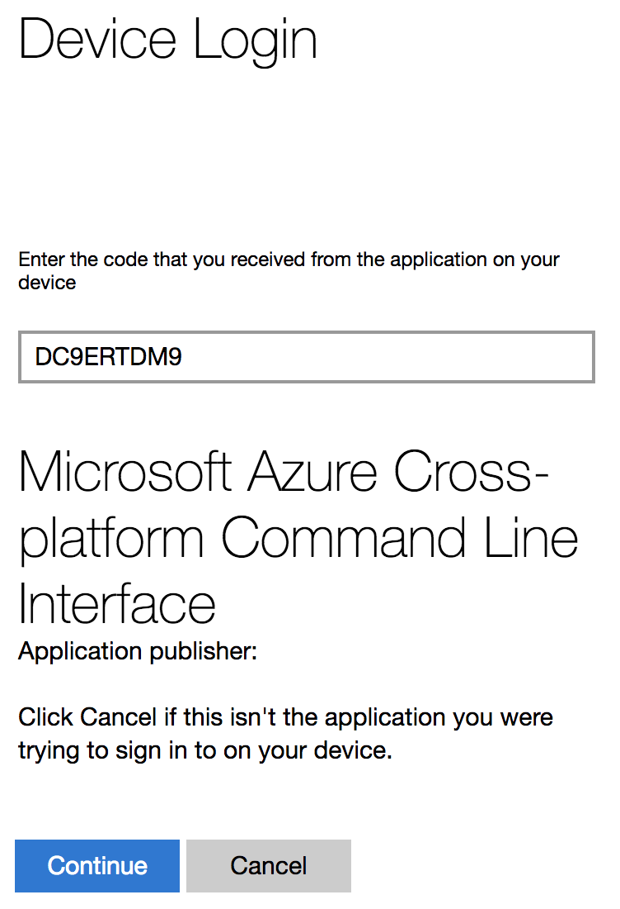
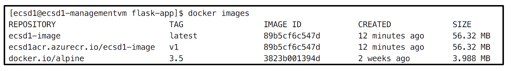

# DevOps Playground #16: All Hands on Azure, ACR and AKS!

  

## Introduction

During this DevOps Playground we are going to use Azure CLI to create a private container registry in Azure ACR and a managed Kubernetes cluster in Azure AKS. We will explore how simple it is to create a cluster, scale it and a deploy a replicated flask app with an automatically provisioned Azure load balancer in front of it. 

**Name:** Billy Michael  
**Role:** DevOps And Continuous Delivery Consultant  
**Email:** billym@ecs-digital.co.uk  
**Linkedin:** https://www.linkedin.com/in/billymichael/  
**Github:** https://github.com/BillyMichael

## Requirements

1. SSH Client
1. Paper with neccesary variables provided by ECS Digital:
  1. Username 
  1. Email
  1. IP Address
  1. Password
  1. Resource Group Name 

## Agenda

1. [Building your docker image](#building-the-container)
1. [Authenticating the Azure CLI](#az-login)
1. [Creating an Azure container registry (ACR)](#creating-a-container-registry)
1. [Creating an Azure container service (AKS)](#creating-an-aks-cluster)
1. [Deploying the application from ACR to AKS using kubectl](#deploying-the-image-from-the-acr)

## Background

### Azure container service (AKS)

- Provides a managed Kubernetes environment.
- It is a quick and easy to deploy and manage containerized applications without container orchestration expertise.
- Eliminates the burden of ongoing operations and maintenance by provisioning, upgrading, and scaling resources on demand, without taking your applications offline.

#### Why use AKS over ACS?
- Automated Kubernetes version upgrades and patching
- Easy cluster scaling
- Self-healing hosted control plane (masters)
- Cost savings - pay only for running agent pool nodes

### Azure container registry (ACR)
- Allows you to store and manage images for all types of container deployments.
- Based on the open-source Docker Registry 2.0.
- Provides a quick an easy way to deploy private container registries. 

# Management

## Logging in to the server

For this demo you have been provided a management VM which is hosted in Azure. This virtual machine has Docker and Azure CLI installed for you to remove any issues you might encounter with installing these two packages. Guides on how to install both of these can be found at:

1. [Docker Installation](https://docs.docker.com/engine/installation/)
1. [Azure CLI 2.0 Installation](https://docs.microsoft.com/en-us/cli/azure/install-azure-cli)

To login to the box you will need to use SSH with the credentials that have been provided.

```
ssh devops@<ipaddress>
```

Your password should have been provided at the start of this playground.

## Ensuring the packages are installed correctly

To verify that both Docker and Azure CLI are installed you can run the version commands.

```
docker --version
az --version
```

This will return the installed versions for both packages.


# Application

## Cloning the repository

To clone the files needed for this playground:

```
git clone https://github.com/ecsdigital/devopsplayground16-aks.git
```

## Building the container

Once you have cloned the repository you need to `cd` to the `flask-app` within the repo. 

```
cd ./devopsplayground16-aks/flask-app
```

You must then build the image using the `Dockerfile` provided. To do this use the `docker build`. 

> **_NOTE:_** Dont forget the dot!

```
docker build -t <username>-image .
```

## Checking the image exists

To check the image was created sucessfully you can run the following command:

``` 
docker images <username>-image
```

At the end of this playground you will deploy your image in AKS. Now, on to Azure!

# Azure CLI

## Az login

To authenticate Azure CLI use:

```
az login
```

You will then receieve a prompt. Follow the URL of this prompt in your browser.


Once the website has loaded enter the code from the CLI prompt.



Now enter the crednetials provided to you at the start of the playground.


You have now successfully authenticated to Azure CLI. This will enable us to run CLI commands as the authenticated user.


# Container Registry

## Creating a Container Registry

To create a container registry you need to use the `az acr` command.

> <span style="color:orange">**_NOTE:_**</span> The ACR name cannot have special charecters so there is no dash "-" in the name.

```
az acr create --resource-group <username>-resourcegroup \
  --name <username>acr \
  --sku Basic
```

For the purpose of this demo you will be using the "Basic" SKU. The type of SKU you use in your own environmnets will vary depending on the requirements you have. The table below shows the differences between the three SKU types.


Once the ACR initialisation is successful you will see the following:


## Logging in to the container registry

To login to the container registry you created you can use the Azure `az acr login` command.

```
az acr login --name <username>acr
```

A list of Azure CLI commands which can be used with ACR can be found [here](https://docs.microsoft.com/en-us/cli/azure/acr?view=azure-cli-latest)

## Tagging the images

Before you can tag the image and push it to the container registry you must determine the hostname of your ACR. This can be achieved using the `az acr list` command.

```
az acr list --resource-group <username>-resourcegroup \
  --query "[].{acrLoginServer:loginServer}" \
  --output table
```


This `AcrLoginServer` hostname can now be used to tag the image.

```
docker tag <username>-image <AcrLoginServer>/<username>-image:v1
```

You can view the docker images to check the tag by using:

```
docker images
```



Now that the image has been tagged it can be pushed to the ACR using:

```
docker push <AcrLoginServer>/<username>-image:v1
```


## Checking the images in the repository

You can view which images are stored in the repository using the `az aks repository` command. This will output a table of all the existing repositories.

```
az acr repository list --name <username>acr --output table
```


# Azure Container Service (AKS)

Due to AKS limitations imposed my Microsoft Azure we are unable to create enough AKS repositories for everyone here. Below provides an explination on how to do this on your own account if you have one. We have created a cluster previously. For the demo please skip to [Configuring Kubectl](#configuring-kubectl)

___

Kubernetes is made up of nodes, deployments, pods, replica-sets and services. So, what are these?

- Node 
  - This is a worker machine
  - Previously known as a minion
  - Can be a VM or physical machine
- Pods
  - A group of one or more containers 
  - These could have shared storage/network
  - Containers in a pod share an IP Address
- ReplicaSet
  -  Ensures that a specified number of pod replicas are running at any one time
- Deployments
  - Allows you to set a desired state Pods and ReplicaSets.
  - Deployment controller changes the actual state to the desired state at a controlled rate.
-  Services
  -  Provides a way to access the pods e.g. LoadBalancer


## Enabling AKS Preview (This will not be part of the playground, Please do not run these commands)

To enable the AKS preview you may have to run:

```
az provider register -n Microsoft.ContainerService
```

## Creating a service principal (This will not be part of the playground, Please do not run these commands)

To allow Azure AKS to interact with Azure APIs you need to create a service principal. This allows it to manage  user-defined routes and the Layer 4 Azure Load Balancers.

To create a service principle use the following command. This will return an `appId` and `password` which are needed for the next section

```
az ad sp create-for-rbac
```

## Creating an AKS Cluster (This will not be part of the playground, Please do not run these commands)

You will use Azure CLI to create a managed kubernetes cluster using Azure AKS. This require the name, resource group and number of agents. 

> <span style="color:orange">**_NOTE:_**</span> For the purpose of this demo please keep agent count as 1

```
az aks create --resource-group <username>-resourcegroup \
  --name <username>-aks \
  --node-count 1 \
  --service-principal <appId> \
  --client-secret <password> \
  --location centralus \
  --generate-ssh-keys 
```

## Configuring Kubectl

To manage kubernetes you must use the Kubernetes CLI called Kubectl. If you don't already have this installed you can run the following command to install it for you

> <span style="color:orange">**_NOTE:_**</span> Installing Kubectl requires sudo permission.

```
sudo az aks install-cli
```

To retrieve the credentials for Kubectl Azure provides a a command. The `az aks get-credentials` command will automatically log you in.

```
az aks get-credentials --resource-group ecsddemo-resourcegroup \
  --name ecsddemo-aks
```

## Viewing Nodes and Pods


To view the nodes you can use:

```
kubectl get nodes
```

And to view the pods you can use:

```
kubectl get pods
```

> <span style="color:red">**_WARNING:_**</span> Do not continue past this point until the nodes and pods have initialised!

## Removing a deployment or Service

Before we begin the creation of our `deployment` and `service` it is important to understand how to delete them in case you run into any issues. If you need to remove a deployment you can run:

```
kubectl delete deployment <username>-deployment
```

To delete a service you can run:

```
kubectl delete service <username>-deployment
```

## Deploying the image from the ACR

To deploy the application you can use the `kubernetes run` command. This will enable you to create a deployment with a replica-set without the need to create a manifest file!

```
kubectl run <username>-deployment --image <AcrLoginServer>/<username>-image:v1 \
  --limits="memory=128Mi"
```

To expose this on an external port you can use a load balancer. The `kubectl expose` command will create an Azure load balancer and public IP. As the container exposes port 5000 but we would like to use port 80 externally you can use `--port` and `--target-port`.

```
kubectl expose deployment <username>-deployment \
  --port 80 \
  --target-port 5000 \
  --type LoadBalancer
```

These two commands will create a deployment, replicaset, pods containing your image which is deployed onto yours nodes and a LoadBalancer service to expose a public IP. The following diagram gives an example of this:

## Verifying the application is deployed

To verify the the manifest has deployed successfully you can check the deployment. To do this run:

```
kubectl get deployment <username>-deployment
```

You can also check that the service has been provisioned successfully using:

```
kubectl get service <username>-deployment
```

## Accessing the Application

To get the public IP of the container run the following:

```
kubectl get service <username>-deployment 
```


> <span style="color:orange">**_NOTE:_**</span> This may take some time for the load balancer to initialise

If you are still waiting for the load balancer you can use "watch mode" with "`-w`":

```
kubectl get service <username>-deployment -w
```

Eventually you will get the public IP of you load balancer. Enter this into your browser to access the web app!


## Scaling the cluster

To scale the cluster you can run the following command:

> <span style="color:orange">**_NOTE:_**</span> Please do not scale past 2 replicas

```
kubectl scale deployments <username>-deployment --replicas 2
```

To ensure your deployment has scaled run:

```
kubectl get deployment <username>-deployment -w  
```


# Additional Content!

## Rolling Upgrades

One of the benefits of Kubernetes is the ability to do rolling updates of you container. To demonstrate this you can overwrite your container with a different image from dockerhub. This is made possible because there is replicaset running for our deployment. To view the replicaset you can use:

```
kubectl get rs | grep <username>-deployment
```

You can replace your christmas pets image with a default flask container. 

```
kubectl set image deployment <username>-deployment \
  <username>-deployment=hooligian/flask:latest
```

If you view the replicaset using the `kubectl get rs | grep <username>-deployment` command you will see that a new replicaset is created and the pods available pods will begin to change!

If you reload you website you should now see the following:


## Roll-back

You may wish to roll back the changes you have made when you updated the container. Kubernetes makes this easy to achieve using the `rollout undo` function!

```
kubectl rollout undo deployment <username>-deployment
```

This will switch back to the old replicaset running the old images immediately. 
